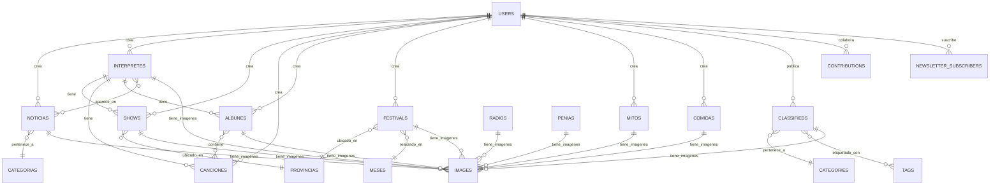

# 🏗️ Documento Técnico — Mi Folklore Argentino

> **Proyecto:** Mi Folklore Argentino (MFA)  
> **Framework:** Laravel 10.x  
> **PHP:** 8.2  
> **Última actualización:** Abril 2026

---

## 1. Stack Tecnológico

### 1.1 Backend

| Tecnología | Versión | Uso |
|---|---|---|
| **PHP** | 8.2+ | Lenguaje principal |
| **Laravel** | 10.x | Framework PHP |
| **MariaDB** | 10.8 | Motor de base de datos |
| **Apache** | 2.x | Servidor web (con mod_rewrite) |
| **Composer** | Latest | Gestión de dependencias PHP |

### 1.2 Frontend

| Tecnología | Versión | Uso |
|---|---|---|
| **Blade** | — | Motor de templates de Laravel |
| **Tailwind CSS** | 3.x | Framework CSS utilitario |
| **Livewire** | 3.x | Componentes reactivos sin JS explícito |
| **Vite** | — | Build tool para assets (CSS/JS) |
| **AdminLTE** | 3.x | Template del panel de administración |

### 1.3 Infraestructura

| Tecnología | Uso |
|---|---|
| **Docker** | Entorno de desarrollo local |
| **Docker Compose** | Orquestación de servicios locales |
| **Hostinger** | Hosting de producción |
| **Git** | Control de versiones |

---

## 2. Arquitectura de la Aplicación

### 2.1 Patrón Arquitectónico

La aplicación sigue el patrón **MVC (Model-View-Controller)** de Laravel, con las siguientes capas adicionales:

```
┌─────────────────────────────────────────────────────┐
│                    CAPA DE PRESENTACIÓN              │
│  ┌─────────────┐  ┌──────────────┐  ┌────────────┐  │
│  │  Frontend    │  │   Backend    │  │    API      │  │
│  │  (Blade +   │  │  (AdminLTE + │  │  (JSON +    │  │
│  │  Tailwind)  │  │   Blade)     │  │  Sanctum)   │  │
│  └──────┬──────┘  └──────┬───────┘  └──────┬─────┘  │
│         │                │                  │        │
└─────────┼────────────────┼──────────────────┼────────┘
          │                │                  │
┌─────────┼────────────────┼──────────────────┼────────┐
│         ▼                ▼                  ▼        │
│              CAPA DE CONTROLADORES                    │
│  ┌──────────────────────────────────────────────┐    │
│  │  Frontend/  │  Backend/   │  Api/            │    │
│  │  Controllers│  Controllers│  Controllers     │    │
│  └──────────────────────────────────────────────┘    │
│                       │                               │
│                       ▼                               │
│              CAPA DE SERVICIOS                        │
│  ┌────────────────┐  ┌─────────────────┐             │
│  │ ImageUpload    │  │ LinkService     │             │
│  │ Service        │  │                 │             │
│  └────────────────┘  └─────────────────┘             │
│                       │                               │
│                       ▼                               │
│              CAPA DE MODELOS (Eloquent ORM)           │
│  ┌──────────────────────────────────────────────┐    │
│  │  Interprete │ Noticia │ Cancion │ Album │ ...│    │
│  │  Show │ Festival │ Mito │ Comida │ User │ ...│    │
│  └──────────────────────────────────────────────┘    │
│                       │                               │
│                       ▼                               │
│              CAPA DE DATOS (MariaDB)                  │
│  ┌──────────────────────────────────────────────┐    │
│  │           Base de datos MySQL/MariaDB         │    │
│  └──────────────────────────────────────────────┘    │
└───────────────────────────────────────────────────────┘
```

### 2.2 Separación por Dominio

Los controladores están organizados en 3 namespaces:

| Namespace | Prefijo de ruta | Middleware | Responsabilidad |
|---|---|---|---|
| `App\Http\Controllers\Frontend` | `/` | Web | Portal público |
| `App\Http\Controllers\Backend` | `/admin` | Web + Auth | Panel de administración |
| `App\Http\Controllers\Api` | `/api/v1` | Sanctum | API REST |

---

## 3. Modelo de Datos

### 3.1 Diagrama Entidad-Relación



### 3.2 Tablas Principales

#### `users`
| Campo | Tipo | Descripción |
|---|---|---|
| `id` | bigint (PK) | Identificador |
| `name` | varchar | Nombre del usuario |
| `email` | varchar (unique) | Email |
| `password` | varchar | Contraseña hasheada |
| `google_id` | varchar (nullable) | ID de Google OAuth |
| `facebook_id` | varchar (nullable) | ID de Facebook OAuth |
| `points` | int | Puntos de gamificación |
| `rank` | varchar | Rango del usuario |
| `email_verified_at` | timestamp | Fecha de verificación |
| `created_at/updated_at` | timestamps | Timestamps automáticos |

#### `interpretes`
| Campo | Tipo | Descripción |
|---|---|---|
| `id` | bigint (PK) | Identificador |
| `interprete` | varchar | Nombre artístico |
| `slug` | varchar (unique) | Slug para URL |
| `biografia` | text | Biografía completa |
| `foto` | varchar | Ruta de la foto |
| `telefono` | varchar | Teléfono de contacto |
| `correo` | varchar | Email |
| `instagram` | varchar | URL de Instagram |
| `twitter` | varchar | URL de Twitter/X |
| `youtube` | varchar | URL de YouTube |
| `visitas` | int | Contador de visitas |
| `estado` | tinyint | 1=activo, 0=inactivo |
| `user_id` | bigint (FK) | Creador |

#### `noticias`
| Campo | Tipo | Descripción |
|---|---|---|
| `id` | bigint (PK) | Identificador |
| `titulo` | varchar | Título de la noticia |
| `slug` | varchar (unique) | Slug para URL |
| `noticia` | text | Contenido completo |
| `foto` | varchar | Imagen principal |
| `categoria_id` | bigint (FK) | Categoría |
| `interprete_id` | bigint (FK, nullable) | Intérprete principal (legacy) |
| `visitas` | int | Contador de visitas |
| `publicar` | tinyint | Flag de publicación |
| `estado` | tinyint | 1=activo, 0=inactivo |
| `user_id` | bigint (FK) | Creador |

#### `canciones`
| Campo | Tipo | Descripción |
|---|---|---|
| `id` | bigint (PK) | Identificador |
| `cancion` | varchar | Título de la canción |
| `slug` | varchar (unique) | Slug para URL |
| `letra` | text | Letra completa |
| `youtube` | varchar | Enlace a YouTube |
| `spotify` | varchar | Enlace a Spotify |
| `visitas` | int | Contador de visitas |
| `publicar` | tinyint | Flag de publicación |
| `estado` | tinyint | 1=activo, 0=inactivo |
| `user_id` | bigint (FK) | Creador |
| `interprete_id` | bigint (FK) | Intérprete |

#### `albunes`
| Campo | Tipo | Descripción |
|---|---|---|
| `id` | bigint (PK) | Identificador |
| `album` | varchar | Nombre del álbum |
| `slug` | varchar (unique) | Slug para URL |
| `anio` | int | Año de lanzamiento |
| `foto` | varchar | Portada |
| `spotify` | varchar | Enlace a Spotify |
| `visitas` | int | Contador de visitas |
| `estado` | tinyint | 1=activo, 0=inactivo |
| `user_id` | bigint (FK) | Creador |
| `interprete_id` | bigint (FK) | Intérprete |

#### `shows`
| Campo | Tipo | Descripción |
|---|---|---|
| `id` | bigint (PK) | Identificador |
| `show` | varchar | Nombre del evento |
| `detalle` | text | Descripción corta |
| `detalles` | text | Descripción extendida |
| `fecha` | date | Fecha del evento |
| `hora` | time | Hora del evento |
| `lugar` | varchar | Nombre del lugar |
| `direccion` | varchar | Dirección |
| `precio_entrada` | varchar | Precio de entrada |
| `link_entradas` | varchar | URL de venta |
| `destacado` | tinyint | Flag destacado |
| `imagen_destacada` | varchar | Imagen para destacado |
| `slug` | varchar (unique) | Slug para URL |
| `lat` | decimal | Latitud GPS |
| `lng` | decimal | Longitud GPS |
| `provincia_id` | bigint (FK) | Provincia |
| `interprete_id` | bigint (FK) | Intérprete |
| `estado` | tinyint | Estado |
| `publicar` | tinyint | Flag de publicación |
| `user_id` | bigint (FK) | Creador |

#### `festivales`
| Campo | Tipo | Descripción |
|---|---|---|
| `id` | bigint (PK) | Identificador |
| `titulo` | varchar | Nombre del festival |
| `slug` | varchar (unique) | Slug para URL |
| `detalle` | text | Descripción |
| `foto` | varchar | Imagen |
| `provincia_id` | bigint (FK) | Provincia |
| `mes_id` | bigint (FK) | Mes de realización |
| `visitas` | int | Contador de visitas |
| `publicar` | tinyint | Flag de publicación |
| `estado` | tinyint | Estado |
| `user_id` | bigint (FK) | Creador |

#### `mitos`
| Campo | Tipo | Descripción |
|---|---|---|
| `id` | bigint (PK) | Identificador |
| `titulo` | varchar | Título |
| `slug` | varchar | Slug para URL |
| `mito` | text | Contenido del mito |
| `foto` | varchar | Imagen |
| `publicar` | tinyint | Flag de publicación |
| `estado` | tinyint | Estado |

#### `comidas`
| Campo | Tipo | Descripción |
|---|---|---|
| `id` | bigint (PK) | Identificador |
| `titulo` | varchar | Nombre de la receta |
| `slug` | varchar | Slug para URL |
| `receta` | text | Contenido de la receta |
| `publicar` | tinyint | Flag de publicación |
| `estado` | tinyint | Estado |

#### `classifieds`
| Campo | Tipo | Descripción |
|---|---|---|
| `id` | bigint (PK) | Identificador |
| `user_id` | bigint (FK) | Usuario que publica |
| `category_id` | bigint (FK) | Categoría |
| `title` | varchar | Título del aviso |
| `slug` | varchar (unique) | Slug para URL |
| `description` | text | Descripción |
| `price` | decimal | Precio |
| `location` | varchar | Ubicación |
| `contact_info` | varchar | Información de contacto |
| `contact_whatsapp` | varchar | Número de WhatsApp |
| `expiration_date` | date | Fecha de expiración |
| `is_active` | boolean | Activo/inactivo |
| `is_featured` | boolean | Destacado |
| `estado` | varchar | `pendiente`, `activo`, `rechazado` |
| `moderator_comment` | text | Comentario del moderador |

#### `contributions`
| Campo | Tipo | Descripción |
|---|---|---|
| `id` | bigint (PK) | Identificador |
| `user_id` | bigint (FK) | Usuario colaborador |
| `contributable_type` | varchar | Tipo de modelo (polimórfico) |
| `contributable_id` | bigint | ID del modelo relacionado |
| `payload` | json | Datos propuestos |
| `status` | varchar | `pending`, `approved`, `rejected` |
| `moderator_comment` | text | Comentario del moderador |

#### `newsletter_subscribers`
| Campo | Tipo | Descripción |
|---|---|---|
| `id` | bigint (PK) | Identificador |
| `user_id` | bigint (FK, nullable) | Usuario vinculado (opcional) |
| `email` | varchar | Email del suscriptor |
| `name` | varchar | Nombre |
| `status` | varchar | `active`, `unsubscribed` |
| `token` | varchar | Token único para desuscripción |
| `source` | varchar | Fuente de la suscripción |
| `unsubscribed_at` | timestamp | Fecha de desuscripción |

#### `images` (Polimórfica)
| Campo | Tipo | Descripción |
|---|---|---|
| `id` | bigint (PK) | Identificador |
| `imageable_type` | varchar | Tipo de modelo (polimórfico) |
| `imageable_id` | bigint | ID del modelo |
| `path` | varchar | Ruta de la imagen |
| ... | ... | Campos adicionales |

### 3.3 Tablas Pivote

| Tabla | Relación |
|---|---|
| `interprete_noticia` | Intérpretes ↔ Noticias (M:N) |
| `albunes_canciones` | Álbumes ↔ Canciones (M:N, con campo `orden`) |
| `classified_tag` | Clasificados ↔ Tags (M:N) |

### 3.4 Tablas de Referencia

| Tabla | Contenido |
|---|---|
| `categorias` | Categorías de noticias |
| `categories` | Categorías de clasificados |
| `tags` | Etiquetas para clasificados |
| `provincias` | Provincias argentinas |
| `meses` | Meses del año |

### 3.5 Tablas de Autorización (Spatie Permission)

| Tabla | Contenido |
|---|---|
| `roles` | Roles del sistema |
| `permissions` | Permisos disponibles |
| `model_has_roles` | Asignación de roles a usuarios |
| `model_has_permissions` | Asignación directa de permisos |
| `role_has_permissions` | Permisos asignados a roles |

---

## 4. Rutas y Endpoints

### 4.1 Rutas Web (Frontend)

```
GET  /                                          → home
GET  /noticias-del-folklore-argentino            → noticias.index
GET  /noticias-del-folklore-argentino/{slug}      → noticias.show
GET  /cartelera-de-eventos-folkloricos           → cartelera.index
GET  /cartelera-de-eventos-folkloricos/{slug}     → cartelera.show
GET  /biografias-de-artistas-folkloricos         → interpretes.index
GET  /biografias-de-artistas-folkloricos/letra/{l}→ interpretes.letra
GET  /letras-de-canciones-folkloricas            → canciones.index
GET  /letras-de-canciones-folkloricas/letra/{l}   → canciones.letra
GET  /discografias-del-folklore-argentino        → discografias.index
GET  /festivales-y-fiestas-tradicionales         → festivales.index
GET  /festivales-y-fiestas-tradicionales/{slug}   → festivales.show
GET  /radios-de-folklore-argentino               → radios.index
GET  /radios-de-folklore-argentino/{slug}         → radios.show
GET  /penias-folkloricas-de-argentina            → penias.index
GET  /penias-folkloricas-de-argentina/{slug}      → penias.show
GET  /mitos-y-leyendas-argentinas                → mitos.index
GET  /mitos-y-leyendas-argentinas/letra/{slug}    → mitos.letra
GET  /mitos-y-leyendas-argentinas/{slug}          → mitos.show
GET  /recetas-de-comidas-tipicas-argentinas       → comidas.index
GET  /recetas-de-comidas-tipicas-argentinas/letra/{s} → comidas.letra
GET  /recetas-de-comidas-tipicas-argentinas/{slug} → comidas.show
GET  /contacto                                   → contacto
POST /contacto                                   → contacto.store
GET  /buscar                                     → buscar
POST /compartir                                  → compartir.store

# Clasificados
GET  /avisos-clasificados                        → classifieds.index
GET  /avisos-clasificados/publicar               → classifieds.create [auth]
POST /avisos-clasificados/publicar               → classifieds.store [auth]
GET  /avisos-clasificados/mis-avisos             → classifieds.mis-avisos [auth]
POST /avisos-clasificados/renovar/{id}           → classifieds.renovar [auth]
GET  /avisos-clasificados/{slug}                 → classifieds.show

# Colaboraciones [auth]
GET  /colaborar                                  → contributions.index
GET  /colaborar/{type}/{id?}                     → contributions.create
POST /colaborar/store                            → contributions.store

# Miniportal del artista
GET  /{artista}                                  → artista.show
GET  /{artista}/biografia                        → artista.biografia
GET  /{artista}/noticias                         → artista.noticias
GET  /{artista}/noticias/{slug}                  → artista.noticia
GET  /{artista}/letras                           → artista.canciones
GET  /{artista}/letras/{slug}                    → artista.cancion
GET  /{artista}/discografia                      → artista.discografia
GET  /{artista}/discografia/{slug}               → artista.disco
GET  /{artista}/shows                            → artista.shows
GET  /{artista}/shows/{slug}                     → artista.showdetalle
GET  /{artista}/entrevistas                      → artista.entrevistas
GET  /{artista}/entrevistas/{slug}               → artista.entrevista

# Social Auth
GET  /auth/google                                → auth.google
GET  /auth/google/callback                       → callback
GET  /auth/facebook                              → auth.facebook
GET  /auth/facebook/callback                     → callback

# Newsletter
POST /newsletter/subscribe                       → newsletter.subscribe
GET  /newsletter/unsubscribe/{token}             → newsletter.unsubscribe

# Sitemap
GET  /sitemap.xml                                → sitemap
GET  /sitemap-news.xml                           → sitemap news
```

### 4.2 Rutas Admin (Backend)

Todas bajo prefijo `/admin` con middleware `auth`:

```
# Dashboard
GET  /admin                                      → dashboard

# CRUD Resources
Resource: /admin/interpretes     → backend.interpretes.*
Resource: /admin/noticias        → backend.noticias.*
Resource: /admin/canciones       → backend.canciones.*
Resource: /admin/discos          → backend.discos.*
Resource: /admin/shows           → backend.shows.*
Resource: /admin/festivales      → backend.festivales.*
Resource: /admin/mitos           → backend.mitos.*
Resource: /admin/comidas         → backend.comidas.*
Resource: /admin/classifieds     → backend.classifieds.*
Resource: /admin/categories      → categories.*
Resource: /admin/tags            → tags.*
Resource: /admin/roles           → roles.*
Resource: /admin/users           → users.*
Resource: /admin/permissions     → permissions.*

# Acciones especiales
POST /admin/canciones/store-ajax                 → backend.canciones.store-ajax
GET  /admin/canciones/data                       → backend.canciones.get
POST /admin/classifieds/{id}/approve             → backend.classifieds.approve
POST /admin/classifieds/{id}/reject              → backend.classifieds.reject

# Contribuciones
GET  /admin/contributions                        → backend.contributions.index
GET  /admin/contributions/{id}                   → backend.contributions.show
POST /admin/contributions/{id}/approve           → backend.contributions.approve
POST /admin/contributions/{id}/reject            → backend.contributions.reject

# Newsletter
GET  /admin/newsletter-subscribers               → backend.newsletter.index
POST /admin/newsletter-subscribers/{id}/toggle   → backend.newsletter.toggle
```

### 4.3 API REST (v1)

Todas bajo prefijo `/api/v1` con middleware `auth:sanctum`:

```
GET|POST        /api/v1/news                     → News CRUD
GET|PUT|DELETE  /api/v1/news/{id}                → News individual
GET|POST        /api/v1/albums                   → Albums CRUD
GET|PUT|DELETE  /api/v1/albums/{id}              → Album individual
GET|POST        /api/v1/songs                    → Songs CRUD
GET|PUT|DELETE  /api/v1/songs/{id}               → Song individual
GET|POST        /api/v1/foods                    → Foods CRUD
GET|PUT|DELETE  /api/v1/foods/{id}               → Food individual
GET|POST        /api/v1/festivals                → Festivals CRUD
GET|PUT|DELETE  /api/v1/festivals/{id}           → Festival individual
GET|POST        /api/v1/artists                  → Artists CRUD
GET|PUT|DELETE  /api/v1/artists/{id}             → Artist individual
GET|POST        /api/v1/myths                    → Myths CRUD
GET|PUT|DELETE  /api/v1/myths/{id}               → Myth individual
```

---

## 5. Dependencias del Proyecto

### 5.1 Dependencias PHP (Producción)

| Paquete | Versión | Uso |
|---|---|---|
| `laravel/framework` | ^10.10 | Framework principal |
| `laravel/sanctum` | ^3.3 | Autenticación API (tokens) |
| `laravel/socialite` | ^5.15 | OAuth social (Google, Facebook) |
| `laravel/ui` | ^4.5 | Scaffolding de autenticación |
| `laravel/tinker` | ^2.8 | REPL interactivo |
| `livewire/livewire` | ^3.0 | Componentes reactivos |
| `spatie/laravel-permission` | ^6.7 | Gestión de roles y permisos |
| `jeroennoten/laravel-adminlte` | ^3.11 | Template panel admin |
| `yajra/laravel-datatables-oracle` | ^10.11 | DataTables server-side |
| `intervention/image` | ^3.11 | Procesamiento de imágenes |
| `guzzlehttp/guzzle` | ^7.2 | Cliente HTTP |
| `realrashid/sweet-alert` | ^7.1 | Alertas frontend |

### 5.2 Dependencias PHP (Desarrollo)

| Paquete | Uso |
|---|---|
| `barryvdh/laravel-debugbar` | Debug bar para desarrollo |
| `fakerphp/faker` | Generación de datos fake |
| `kitloong/laravel-migrations-generator` | Generador de migraciones desde BD |
| `laravel/pint` | Code style fixer |
| `laravel/sail` | Docker dev environment |
| `phpunit/phpunit` | Testing |
| `spatie/laravel-ignition` | Página de error mejorada |

### 5.3 Dependencias Frontend

Definidas en `package.json`:

| Paquete | Uso |
|---|---|
| `vite` | Build tool |
| `tailwindcss` | Framework CSS |
| `postcss` | Procesador CSS |
| `autoprefixer` | Prefijos CSS automáticos |

---

## 6. Patrones de Diseño Utilizados

### 6.1 CommonMethodsTrait

Trait compartido entre entidades de contenido que proporciona métodos comunes:

| Método | Descripción |
|---|---|
| `getNLast($model, $n)` | Obtiene los últimos N registros activos |
| `getNMostVisited($model, $n)` | Obtiene los N más visitados |
| `getNStartsWith($model, $n, $letter)` | Filtra por letra inicial |
| `search($model, $term, $columns)` | Búsqueda en múltiples columnas |
| `getRelatedContent($interprete, $seccion, $actual)` | Contenido relacionado del artista |

**Modelos que lo usan:** `Interprete`, `Noticia`, `Cancion`, `Album`, `Show`, `Festival`, `Mito`, `Comida`

### 6.2 Relaciones Polimórficas

#### Images (Morphable)
La tabla `images` usa relación polimórfica `morphMany` para asociar imágenes a cualquier modelo:

```php
// En cada modelo
public function images()
{
    return $this->morphMany(Image::class, 'imageable');
}
```

**Modelos con imágenes:** Interprete, Noticia, Show, Album, Festival, Mito, Comida, Classified, Radio, Penia

#### Contributions (Morphable)
Las contribuciones de usuarios se asocian polimórficamente a cualquier entidad:

```php
public function contributable()
{
    return $this->morphTo();
}
```

### 6.3 Scopes de Eloquent

| Modelo | Scope | Descripción |
|---|---|---|
| `Interprete` | `scopeActive` | Filtra activos, ordena por nombre |
| `NewsletterSubscriber` | `scopeActive` | Filtra suscriptores activos |
| `Classified` | `scopeActivo` | Filtra clasificados activos |
| `Classified` | `scopePendiente` | Filtra clasificados pendientes |

### 6.4 Service Layer

| Servicio | Responsabilidad |
|---|---|
| `ImageUploadService` | Procesamiento y almacenamiento de imágenes subidas |
| `LinkService` | Generación y gestión de enlaces |

### 6.5 URL Generation Pattern

Cada modelo de contenido implementa un método `getUrl()` que genera la URL pública correcta, teniendo en cuenta si el contenido está asociado a un intérprete (miniportal) o es general:

```php
public function getUrl(): string
{
    if ($this->interprete) {
        return route('artista.noticia', [
            'interprete' => $this->interprete->slug,
            'noticia' => $this->slug
        ]);
    }
    return route('noticias.show', ['slug' => $this->slug]);
}
```

---

## 7. Autenticación y Autorización

### 7.1 Autenticación

| Método | Implementación |
|---|---|
| **Session-based** | Laravel UI (`Auth::routes()`) |
| **Google OAuth** | Socialite + `SocialiteController` |
| **Facebook OAuth** | Socialite + `SocialiteController` |
| **API Tokens** | Laravel Sanctum (`HasApiTokens` en User) |

### 7.2 Middleware

| Middleware | Uso |
|---|---|
| `auth` | Rutas de backend, clasificados (CRUD), colaboraciones |
| `auth:sanctum` | API REST |
| `web` | Rutas públicas del frontend |

### 7.3 Autorización (Spatie Permission)

```php
// User model
use HasRoles;

// Verificar en controlador
$user->getRoleNames();
$user->getAllPermissions();
```

---

## 8. Sistema de Emails

### 8.1 Mailables

| Clase | Trigger | Descripción |
|---|---|---|
| `ContactSendEmail` | Formulario de contacto | Respuesta automática al remitente |
| `ContactRecieveEmail` | Formulario de contacto | Notificación al equipo |
| `WeeklyNewsletterMail` | Job semanal | Newsletter con contenido reciente |
| `AlbumCreated` | Creación de álbum | Notificación de nuevo álbum |
| `CancionCreated` | Creación de canción | Notificación de nueva canción |
| `ComidaCreated` | Creación de receta | Notificación de nueva receta |
| `FestivalCreated` | Creación de festival | Notificación de nuevo festival |
| `MitoCreated` | Creación de mito | Notificación de nuevo mito |
| `ShowCreated` | Creación de show | Notificación de nuevo show |

### 8.2 Jobs

| Job | Cola | Frecuencia |
|---|---|---|
| `SendNewsletterJob` | default | Semanal (programado) |

---

## 9. Configuración Docker

### 9.1 docker-compose.yml

3 servicios orquestados:

```yaml
services:
  app:       # PHP 8.2 + Apache (custom build)
    ports: [80:80]
    volumes:
      - ./:/var/www/html
      - /var/www/html/vendor  # vendor queda en el contenedor

  db:        # MariaDB 10.8
    ports: [3306:3306]
    volumes:
      - ./database_local:/var/lib/mysql

  phpmyadmin: # phpMyAdmin 5.1.1
    ports: [8080:80]
```

### 9.2 Dockerfile

Imagen custom basada en `php:8.2-apache`:
- Extensiones PHP: `zip`, `pdo_mysql`, `gd` (con freetype, jpeg, webp), `opcache`.
- Apache con `mod_rewrite` habilitado.
- Document root: `/var/www/html/public`.
- Node.js 20.x para build de assets.
- Composer latest.
- `php.ini` customizado.

### 9.3 Notas Importantes

- El volumen `vendor` está excluido del bind mount (`/var/www/html/vendor`) para que las dependencias vivan dentro del contenedor y no se sobreescriban desde el host Windows.
- La carpeta `database_local/` almacena los datos de MariaDB persistentes entre reinicios de Docker.

---

## 10. Configuración de Assets

### 10.1 Build Tools

| Herramienta | Archivo de config |
|---|---|
| **Vite** | `vite.config.js` |
| **Tailwind CSS** | `tailwind.config.js` |
| **PostCSS** | `postcss.config.js` |

> **Nota:** También existe `webpack.mix.js` (legacy), pero el proyecto migró a Vite.

### 10.2 Comandos

```bash
# Desarrollo (con hot reload)
npm run dev

# Producción (minificado)
npm run build
```

---

## 11. SEO Técnico

### 11.1 Estrategia de URLs

Las URLs del frontend están diseñadas con slugs largos orientados al posicionamiento SEO, ya posicionados en motores de búsqueda:

```
/noticias-del-folklore-argentino
/biografias-de-artistas-folkloricos
/letras-de-canciones-folkloricas
/discografias-del-folklore-argentino
/cartelera-de-eventos-folkloricos
/festivales-y-fiestas-tradicionales
/radios-de-folklore-argentino
/penias-folkloricas-de-argentina
/mitos-y-leyendas-argentinas
/recetas-de-comidas-tipicas-argentinas
/avisos-clasificados
```

> ⚠️ **No modificar estas URLs** — están posicionadas en Google y cambiarlas afectaría el SEO negativamente.

### 11.2 Datos Estructurados

- **JSON-LD** en el home con schemas `WebSite`, `Organization`, `SearchAction`.
- Configurción de `sameAs` con redes sociales oficiales.

### 11.3 Sitemaps

| Archivo | Generador | Contenido |
|---|---|---|
| `/sitemap.xml` | `SitemapController@index` | Todas las URLs del sitio |
| `/sitemap-news.xml` | `SitemapController@newsIndex` | Noticias recientes (Google News) |

---

## 12. Testing

### 12.1 Framework de Testing

| Herramienta | Versión |
|---|---|
| **PHPUnit** | ^10.1 |
| **Mockery** | ^1.4.4 |

### 12.2 Estado Actual

⚠️ **No se identificaron tests implementados.** La carpeta `tests/` existe pero no se encontraron tests personalizados activos.

### 12.3 Ejecución

```bash
php artisan test
# o
./vendor/bin/phpunit
```

---

## 13. Archivos de Configuración Externos

| Archivo | Propósito |
|---|---|
| `.env` | Variables de entorno (no se commitea) |
| `.env.example` | Template de variables de entorno |
| `.htaccess` | Reglas de Apache (root y public) |
| `apache.conf` | Configuración de VirtualHost para Docker |
| `php.ini` | Configuración personalizada de PHP |
| `Dockerfile` | Definición de imagen Docker |
| `docker-compose.yml` | Orquestación de servicios Docker |
| `composer.json` | Dependencias PHP |
| `package.json` | Dependencias Node.js |
| `vite.config.js` | Configuración de Vite |
| `tailwind.config.js` | Configuración de Tailwind CSS |
| `postcss.config.js` | Configuración de PostCSS |
| `phpunit.xml` | Configuración de PHPUnit |
| `.editorconfig` | Estilo de código del editor |
| `.styleci.yml` | Estilo de código CI |
| `postman_collection.json` | Colección de Postman para la API |

---

## 14. Scripts y Herramientas Auxiliares

| Archivo | Propósito |
|---|---|
| `generate_postman.php` | Genera la colección de Postman para la API |
| `generate_token.php` | Genera tokens de autenticación para la API |
| `postman_collection.json` | Colección exportada de Postman |

---

## 15. Consideraciones Técnicas y Deuda Técnica

### 15.1 Observaciones

| Área | Observación | Prioridad |
|---|---|---|
| **Tests** | No hay tests implementados | 🟡 Media |
| **Validación** | Verificar que todos los controladores usen Form Requests | 🟡 Media |
| **Duplicación `estado`/`publicar`** | Algunos modelos tienen ambos campos con funciones similares | 🟡 Media |
| **Nomenclatura mixta** | Algunos modelos usan español (Noticia, Cancion) y otros inglés (Classified, Contribution) | 🟢 Baja |
| **Categorías duplicadas** | Existen `categorias` (noticias) y `categories` (clasificados) como tablas separadas | 🟢 Baja |
| **Controlador Videos** | `VideosController.php` existe pero está vacío/sin implementar | 🟢 Baja |
| **Entrevistas** | Controlador creado pero sin CRUD backend ni vistas completas | 🟡 Media |
| **CommonMethodsTrait search** | Retorna string si no hay resultados en lugar de colección vacía | 🟢 Baja |
| **N+1 Queries** | Verificar eager loading en todas las consultas de listados | 🟡 Media |
| **Cache** | No se identificó uso de cache para consultas frecuentes | 🟡 Media |
| **Rate Limiting** | No configurado para rutas sensibles | 🟠 Alta |
| **Newsletter** | En fase de prueba, no validado en producción | 🟡 Media |
